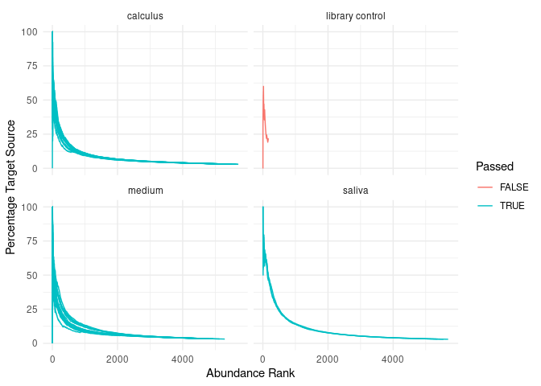

```r
head(kraken_taxatab)
```

<div data-pagedtable="false">
  <script data-pagedtable-source type="application/json">
{"columns":[{"label":["species"],"name":[1],"type":["chr"],"align":["left"]},{"label":["LIB030.A0117"],"name":[2],"type":["dbl"],"align":["right"]},{"label":["SYN001.A0101"],"name":[3],"type":["dbl"],"align":["right"]},{"label":["SYN002.A0101"],"name":[4],"type":["dbl"],"align":["right"]},{"label":["SYN003.A0101"],"name":[5],"type":["dbl"],"align":["right"]},{"label":["SYN005.I0101"],"name":[6],"type":["dbl"],"align":["right"]},{"label":["SYN006.I0101"],"name":[7],"type":["dbl"],"align":["right"]},{"label":["SYN008.I0101"],"name":[8],"type":["dbl"],"align":["right"]},{"label":["SYN009.I0101"],"name":[9],"type":["dbl"],"align":["right"]},{"label":["SYN012.I0101"],"name":[10],"type":["dbl"],"align":["right"]},{"label":["SYN013.I0101"],"name":[11],"type":["dbl"],"align":["right"]},{"label":["SYN014.A0101"],"name":[12],"type":["dbl"],"align":["right"]},{"label":["SYN014.C0101"],"name":[13],"type":["dbl"],"align":["right"]},{"label":["SYN015.B0101"],"name":[14],"type":["dbl"],"align":["right"]},{"label":["SYN015.D0101"],"name":[15],"type":["dbl"],"align":["right"]},{"label":["SYN015.E0101"],"name":[16],"type":["dbl"],"align":["right"]},{"label":["SYN015.F0101"],"name":[17],"type":["dbl"],"align":["right"]},{"label":["SYN015.G0101"],"name":[18],"type":["dbl"],"align":["right"]},{"label":["SYN015.H0101"],"name":[19],"type":["dbl"],"align":["right"]},{"label":["SYN015.I0101"],"name":[20],"type":["dbl"],"align":["right"]},{"label":["SYN016.I0101"],"name":[21],"type":["dbl"],"align":["right"]},{"label":["SYN017.A0101"],"name":[22],"type":["dbl"],"align":["right"]},{"label":["SYN017.B0101"],"name":[23],"type":["dbl"],"align":["right"]},{"label":["SYN017.D0101"],"name":[24],"type":["dbl"],"align":["right"]},{"label":["SYN017.E0101"],"name":[25],"type":["dbl"],"align":["right"]},{"label":["SYN017.F0101"],"name":[26],"type":["dbl"],"align":["right"]},{"label":["SYN017.G0101"],"name":[27],"type":["dbl"],"align":["right"]},{"label":["SYN018.C0101"],"name":[28],"type":["dbl"],"align":["right"]},{"label":["SYN018.H0101"],"name":[29],"type":["dbl"],"align":["right"]},{"label":["SYN018.I0101"],"name":[30],"type":["dbl"],"align":["right"]},{"label":["SYN019.I0101"],"name":[31],"type":["dbl"],"align":["right"]},{"label":["SYN021.I0101"],"name":[32],"type":["dbl"],"align":["right"]},{"label":["SYN022.I0101"],"name":[33],"type":["dbl"],"align":["right"]},{"label":["SYN023.I0101"],"name":[34],"type":["dbl"],"align":["right"]},{"label":["SYN025.I0101"],"name":[35],"type":["dbl"],"align":["right"]},{"label":["SYN026.I0101"],"name":[36],"type":["dbl"],"align":["right"]},{"label":["SYN028.I0101"],"name":[37],"type":["dbl"],"align":["right"]}],"data":[{"1":"Burkholderia pyrrocinia","2":"3","3":"4","4":"6","5":"5","6":"1","7":"1","8":"1","9":"NA","10":"NA","11":"1","12":"NA","13":"NA","14":"4","15":"3","16":"1","17":"3","18":"3","19":"2","20":"NA","21":"3","22":"NA","23":"NA","24":"1","25":"NA","26":"1","27":"NA","28":"9","29":"5","30":"NA","31":"NA","32":"NA","33":"4","34":"NA","35":"1","36":"2","37":"1"},{"1":"Burkholderia multivorans","2":"3","3":"27","4":"25","5":"38","6":"75","7":"31","8":"14","9":"66","10":"121","11":"8","12":"7","13":"5","14":"29","15":"14","16":"18","17":"48","18":"11","19":"13","20":"96","21":"16","22":"31","23":"7","24":"12","25":"13","26":"7","27":"3","28":"67","29":"12","30":"2","31":"158","32":"40","33":"66","34":"95","35":"111","36":"59","37":"125"},{"1":"Burkholderia cenocepacia","2":"3","3":"15","4":"24","5":"17","6":"71","7":"38","8":"29","9":"60","10":"65","11":"6","12":"18","13":"12","14":"22","15":"9","16":"11","17":"33","18":"13","19":"7","20":"54","21":"22","22":"32","23":"15","24":"15","25":"11","26":"1","27":"5","28":"51","29":"4","30":"2","31":"134","32":"44","33":"51","34":"52","35":"134","36":"60","37":"57"},{"1":"Burkholderia stabilis","2":"2","3":"7","4":"10","5":"14","6":"39","7":"30","8":"NA","9":"42","10":"71","11":"5","12":"5","13":"3","14":"7","15":"1","16":"5","17":"8","18":"2","19":"5","20":"78","21":"19","22":"21","23":"9","24":"NA","25":"7","26":"6","27":"2","28":"18","29":"1","30":"9","31":"85","32":"13","33":"39","34":"73","35":"61","36":"36","37":"90"},{"1":"Burkholderia ubonensis","2":"2","3":"18","4":"5","5":"15","6":"3","7":"4","8":"4","9":"7","10":"4","11":"7","12":"9","13":"1","14":"5","15":"5","16":"1","17":"11","18":"6","19":"8","20":"7","21":"4","22":"3","23":"2","24":"2","25":"2","26":"2","27":"2","28":"30","29":"10","30":"2","31":"5","32":"2","33":"1","34":"2","35":"8","36":"10","37":"8"},{"1":"Burkholderia ambifaria","2":"2","3":"2","4":"8","5":"4","6":"NA","7":"1","8":"NA","9":"NA","10":"NA","11":"NA","12":"1","13":"NA","14":"2","15":"NA","16":"NA","17":"NA","18":"3","19":"NA","20":"1","21":"1","22":"NA","23":"NA","24":"NA","25":"2","26":"1","27":"NA","28":"5","29":"3","30":"NA","31":"1","32":"1","33":"1","34":"NA","35":"1","36":"2","37":"1"}],"options":{"columns":{"min":{},"max":[10]},"rows":{"min":[10],"max":[10]},"pages":{}}}
  </script>
</div>


```r
taxa_table <- load_taxa_table(kraken_taxatab)
iso_database <- load_database(cuperdec_database_ex, target = "oral")
metadata_table <- load_map(metadata,
                           sample_col = "sample",
                           source_col = "source"
                           )

curves <- calculate_curve(taxa_table, iso_database)
filter_result <- simple_filter(curves, 60)
```


```r
plot_cuperdec(curves, metadata_table, filter_result)
```

<!-- -->

